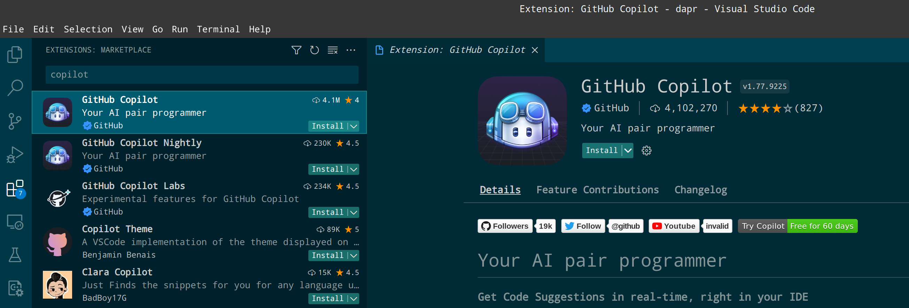
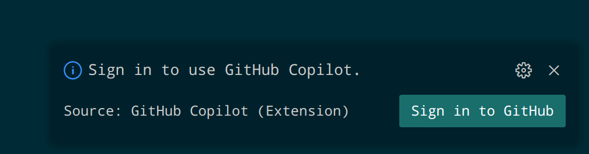
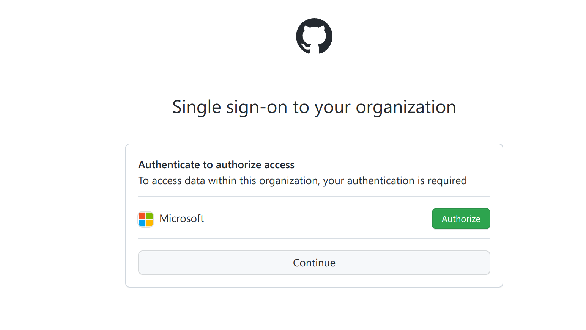
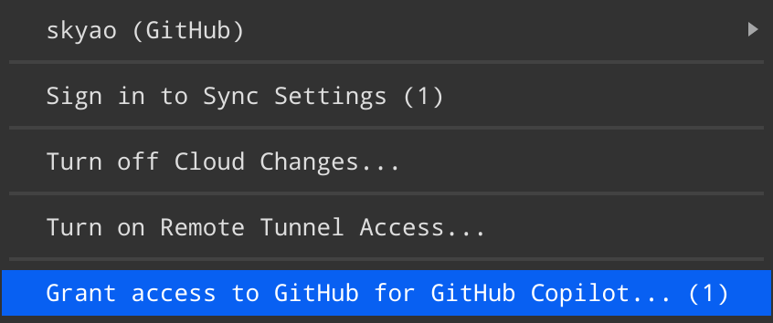
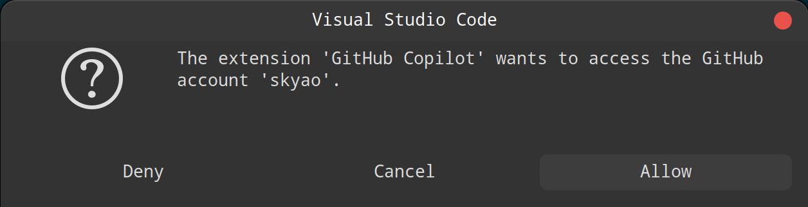
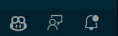
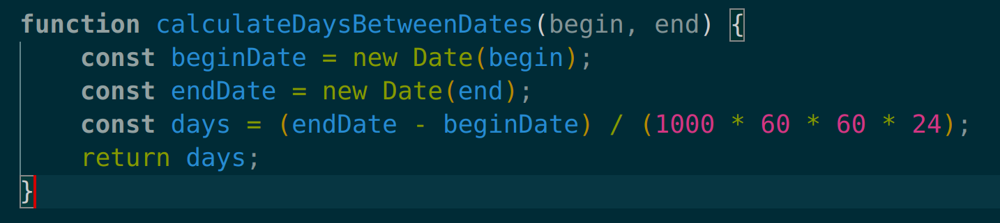

参考：

[Getting started with GitHub Copilot in Visual Studio Code - GitHub Docs](https://docs.github.com/en/copilot/getting-started-with-github-copilot/getting-started-with-github-copilot-in-visual-studio-code)

## 步骤

### 安装 copilot 扩展

打开 vs code 的 extension marketplace, 搜索 compilot：



### 登录组织

扩展安装完成之后，vs code 提示要登录以使用 github copilit：



因为我是 microsoft 组织的成员，所以就简单了，在这里点 continue 就好：



### github 开启 copilot

github 设置开启 copilot : [Configuring GitHub Copilot settings on GitHub.com - GitHub Docs](https://docs.github.com/en/copilot/configuring-github-copilot/configuring-github-copilot-settings-on-githubcom#enabling-or-disabling-duplication-detection)  。

完成后，vs code 左下角会有一个提示



点击后继续提示：



容许之后，在 vs code 右下角可以看到 copilot 的标记：



## 使用

### js 的简单例子 

参考文档的说明：

https://docs.github.com/en/copilot/getting-started-with-github-copilot/getting-started-with-github-copilot-in-visual-studio-code#seeing-your-first-suggestion

在 vs code 中新建 a.js 文件，输入 

```javascript
function calculateDaysBetweenDates(begin, end) {
```

就能看到 copilot 的建议代码: 



### golang 的简单例子

新建一个 test.go 文件，输入提示注释, 回车之后， copilot 建议代码如下：

```go
// server on port 8080
func main() {
	http.HandleFunc("/", func(w http.ResponseWriter, r *http.Request) {
		w.Write([]byte("Hello, World!"))
	})
	http.ListenAndServe(":8080", nil)
}
```


